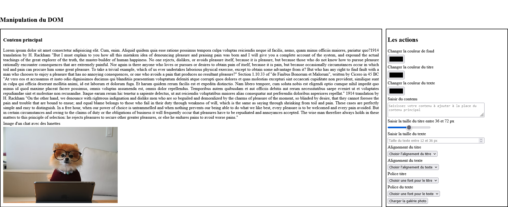

# TP : manipulation du DOM partie Javascript

## Objectifs du TP

- Utiliser le javascript pour modifier les éléments HTML et les valeurs des propriétés CSS
- versionner son projet avec Git

## Consigne jour 4 :  manipulation du DOM

A l'aide des évènements, modifiez les propriétés CSS ou le contenu des éléments du bloc de gauche.
Les actions à effectuer :
- ajoutez les options des sélections depuis javascript ;
- modifiez la couleur de fond ;
- modifiez les couleurs du titre et du texte ;
- modifiez les alignements du titre et du texte ;
- modifiez ou ajoutez du contenu au texte initial ;
- modifiez les tailles du titre et du texte ;
- modifiez les polices du titre et du texte ;
- lorsque la souris survole la photo :
 1.1 modifiez l’apparence du curseur ;
 1.2 affichez tout en haut de la page le message "Vous êtes en train de survoler l'image" ;
- lorsque la souris ne survole plus l'image, effacez/cachez le message précedent.

### Maquette de la page version desktop (bureau)

